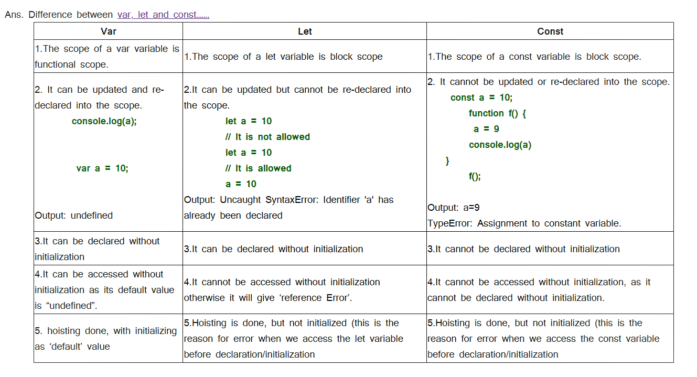

# JavaScript-Interview-Question
# Javascript


### Q.1. What is javascript? How does it work?
**Ans. JavaScript is the world's most popular programming language. Javascript is used by programmers across the world to create dynamic and interactive web content like applications and browsers.
     JavaScript is an interpreted language, not a compiled language. A program such as C++ or Java needs to be compiled before it is run. The source code is passed through a program called a compiler, which translates it into bytecode that the machine understands and can execute. In contrast, JavaScript has no compilation step. Instead, an interpreter in the browser reads over the JavaScript code, interprets each line, and runs it.**

### Q.2. What is an asynchronous operation? Is Javascript synchronous or asynchronous.
**Ans. Synchronous JavaScript: As the name suggests synchronous means to be in a sequence, i.e., every statement of the code gets executed one by one. So, basically a statement has to wait for the earlier statement to get executed.
    Asynchronous JavaScript: Asynchronous code allows the program to be executed immediately where the synchronous code will block further execution of the remaining code until it finishes the current one.
     JavaScript is a synchronous, blocking, single-threaded language. That just means that only one operation can be in progress at a time.**

### Q.3. Explain async using set timeout?
**Ans. setTimeout() is an asynchronous function, meaning that the timer function will not pause execution of other functions in the functions stack. In other words, you cannot use setTimeout() to create a "pause" before the next function in the function stack fires. JavaScript is single-threaded therefore it can only do one task at a time. It means that it can only carry a single task a given time. The setTimeout() sets a timer and executes a callback function after the timer expires.**

### Q.4. JS is a single threaded or multi-threaded?
**Ans. JavaScript is a single-threaded language because while running code on a single thread, it can be really easy to implement as we don’t have to deal with the complicated scenarios that arise in the multi-threaded environment. JavaScript is synchronous in nature.**

### Q.5 Is JS asynchronous or synchronous language?
**Ans. JavaScript is a synchronous, blocking, single-threaded language. That just means that only one operation can be in progress at a time. But it can be asynchronous in some specific tasks. The word asynchronous means not occurring at the same time. Typically, executing things in sequence works well. But you may sometimes need to fetch data from the server or execute a function with a delay, something you do not anticipate occurring NOW. So, you want the code to execute asynchronously. We can classify most asynchronous JavaScript operations with two primary triggers: Browser API/Web API events or functions: These include methods like setTimeout, or event handlers like click, mouse over, scroll, and many more. Promises: A unique JavaScript object that allows us to perform asynchronous operations.**

### Q.6 How to create simple server [Hello World]
Ans:- Create NodeJS Application: Initialize the NodeJS application using the following command, it will create package.json files to intall dependencies
```js
npm init
```
Module Installation: Install the express module which is a web framework for NodeJS using the following command.
```js
npm install express
```
Implementation: Create an app.js file and write down the following code in it.
```js
// Require would make available the express package to be used in our code

const express = require("express");

// Creates an express object

const app = express();

// It listens to HTTP get request. Here it listens to the root i.e '/'

app.get("/", (req, res) => {

// Using send function we send response to the client  Here we are sending html

res.send("<h1 style=text-align:center;margin-top:20%;font-size:200px;color:maroon;> Hello World </h1>");
});

// It configures the system to listen to port 3000. Any number can be given instead of 3000

app.listen(3000, () => {                                          
console.log("Listening to port 3000");        // Print in the console when the servers starts to listen on 3000
});

```
Step to run the application: Run the app.js file using the following command.
```
node app.js  or nodemon
```
Output: Now open your browser and go to http://localhost:3000/, you will see the output:
```
Hello World
```

### Q.7 Difference between var let and const? 


### [What is hoisting ](README.md#25--what-is-hoisting )

### [What is a promise? ](README.md#51--what-is-a-promise )

### [What are the states of promises.](README.md#53--what-are-the-three-states-of-promise )

### [What is promisify?](README.md)

### [What is async await?](README.md)

### [Difference between promise and async & await. Is async await notation preferred over promises? If so, why?](README.md)

### [What are JavaScript Objects ? how to create them. ](README.md#1--what-are-the-possible-ways-to-create-objects-in-javascript)


### [How to search for a value or a key in an object? ](README.md#199--how-do-you-get-enumerable-key-and-value-pairs)

### [What is a callback function?](README.md#54--what-is-a-callback-function) 

### [What are the drawbacks of callback](README.md#93--what-are-the-pros-and-cons-of-promises-over-callbacks)

### [ what is callback hell.](README.md#56--what-is-a-callback-hell)

###  [What is the difference between callback and promise.](README.md#93--what-are-the-pros-and-cons-of-promises-over-callbacks)

### [How can you write the same async operation using promise and callback ](README.md)

### [Difference between function and arrow function](README.md#10--what-are-lambda-or-arrow-functions)

### [Difference between i++ and ++i]](README.md)

### [What is the “this” operator?]
** Ans. “This” keyword refers to an object that is executing the current piece of code. It references the object that is executing the current function. If the function being referenced is a regular function, “this” references the global object.
```js
var value =50
function myFunction(){
var value = 100;
alert("value: " + value)  // gives current value: 100
alert("value: " this.value) // references the global object i.e, value : 50 
}
myFunction()
```
If function that is being referenced is a method or a constructor in an object,"This" references the object itself.
```js
class Bike {
  constructor(color, model) {
    this.color = color;
    this.model = model;
  }

  getDetails() {
    return this.model + " bike has" + this.color + " color";
  }
}
```
**
### [What is the closure concept?](README.md#27--what-are-closures)

### [what is closure - with code, why is it required, it's benefits](README.md#27--what-are-closures) 

### [What is json?](README.md#4--what-is-json-and-its-common-operations)

### [What do the functions json.parse](README.md#114--how-do-you-parse-json-string) 

### [What json.stringify do?](README.md#113--what-is-the-purpose-json-stringify)

### [What is the difference between '==' and '===' operators?](README.md#9--what-is-the-difference-between--and--operators) 

### [What is the typeof operator?](README.md#71--what-is-typeof-operator)

### [What is NaN?](README.md#83--what-is-nan-property)

### [What are settimeout](README.md#106--what-is-the-use-of-settimeout) 

### [and setinterval functions and what is the difference between them?](README.md#107--what-is-the-use-of-setinterval)

### [What is functional scope and block scope? ](README.md)

### [What is shallowCopy and deepCopy](README.md#345--what-is-the-difference-between-shallow-and-deep-copy)

### [What is the difference between map and filter. Explain math , the built-in javascript object, functionalities. ](README.md)

### [What is ES6? ](README.md#305--what-is-es6)

### [Explain some features of ES6](README.md#304--list-down-some-of-the-features-of-es6)

### [Difference btw typescript & javascript.](README.md#253--what-are-the-advantages-of-typescript-over-javascript)

### [what is regex?](README.md#154--what-is-a-regular-expression)

### [what is first class functions](README.md#11--what-is-a-first-class-function)

### [diff between primitive and reference data types](README.md#223--what-are-primitive-data-types)

### [Difference between null and undefined](README.md#74--what-is-the-difference-between-null-and-undefined)

### [difference between slice and splice ](README.md#7--what-is-the-difference-between-slice-and-splice)

### [what is spread operater and rest operator](README.md#415--what-are-the-differences-between-spread-operator-and-rest-parameter)

### [how to convert intiger to string and string to integer](README.md)

### Explain JS Object methods like-  [Object.Keys](README.md#125--how-do-you-check-if-a-key-exists-in-an-object),  [Object.values](README.md#287--how-to-get-the-value-from-get-parameters) and [Object.entries](README.md#135--how-do-you-add-a-key-value-pair-in-javascript)


###                                                      API
### What is an API? 
### What are Rest Api?
### What are rest Api ? why they are stateless?
### What are the different ways to pass data to an API while requesting a Create operation? Discuss the Content-Type header in brief
### Explain the GET, POST, PUT, POST and PATCH method types
### DIfference between PUt and Patch
### What is an HTTP status code? Discuss the popularly used codes along with their usecase.
### What are http status codes? Please elaborate?


###                                                        Nodejs
### What is Nodejs?
###  What is the difference between Javascript and Nodejs? 
### Node js is single threaded or multi threaded? Explain in detail what that means. 
### What is meant by request and response cycle in a nodejs application?
### What is express?
### What are the benefits of using this framework?
### What is Middleware? 
### What are global and route level middlewares?
### Explain about application and route based middleware?
### What is the function of an express router? What is a route and route splitting?
### How Nodejs is different from a multithreaded architecture?
### What is .env file or environment variables? Why are they important?
### What is an event loop? Explain with an example.
### security  -  how would you protect your node js server?


###                                                   MongodDb
### Why is a database? Name a few examples.
### Why you use MongoDB over MySQL and PostgreSQL?  MySql vs MongoDb ( or SQL/RDBMS vs NoSql). 
### Compare relational and non-Relational databases and their benefits or drawbacks? 
### What kind of db is MongoDb? Why do we define schema in nodejs application when working with Mongodb if it is schema-less?
### What is an aggregation pipeline? What are some stages used in it?
### What is a  Schema and a model in mongoose. How are they different?
### Discuss some common mongoose APIs for CRUD operations.
### Why do you have to use await if you want to process the result.
### What are indexes?  What is the default index value set by MongoDB?
### What do you mean by database indexing? 
### How to link the document of one collection to a document in another collection using mongoose. Explain reference in mongoose.
### What is the difference between find, findOne, findOneAndUpdate ,findById , updateOne, update and updateMany? When should you use each?


###                                                    AWS
### What is AWS and AWS S3 ? 
### What are the command to push in AWS S3?
### What is meant by a bucket?
### Can we upload image in database w/o using AWS S3. What are the benefits of using s3 instead?


###                                                    Caching
	
### What is meant by cache and caching?
### Why we use redis 
### Why do we need redis if we have databases?
### Redis advantages and disadvantages.
### Explain cache miss and cache hit.


###                                                       Auth
### What is authentication and authorization? What is the difference between them?
### What is jwt? Describe the parts of JWT? What are the benefits of using a JWT 
### Why authorization is necessary?
### How did you protected your Routes?

###                                                       Project
### How do you implement authentication in your project?
### Explain the flow how a user is authenticated and the prerequisite for the same (token generation and sharing with the client)
### How to generate a token ? How to verify it ?
### Explain URL shortener project (explain the overview, features and how using redis). What is shortid. What happens if the same long url is passed in the request twice. How can you create a unique short code without using shortid package? How is the redirection happening?
### Why do we use mvc (model view controller) in projects 
### Deploy your project on Heroku ?

###                                               Other (OOPS + Git + Multithreading)
###                                                       OOPS overview.
### What is inheritance and abstraction .
### What is Git? 
### What are some basic git commands?
### What is a Git repository and branches? 
### What is difference between Git and GitHub
### What is class,id in html? What is DOM?
